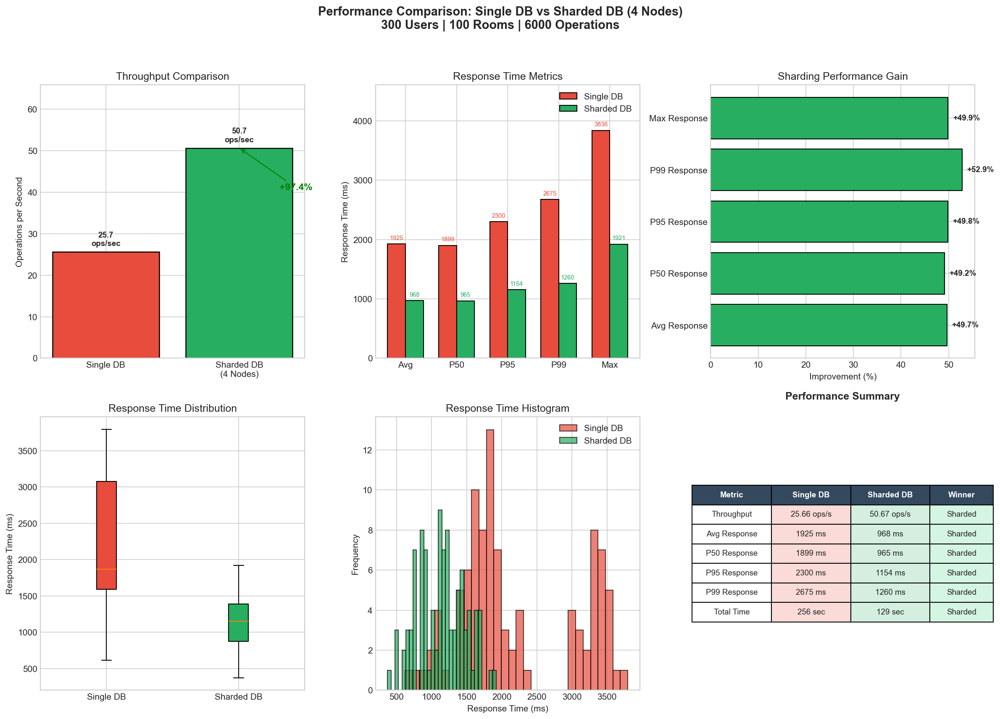

# Kesimpulan Performance Test: Single Database vs Sharded Database

## 1. Ringkasan Eksekutif

Berdasarkan hasil pengujian performa yang dilakukan pada aplikasi chat dengan konfigurasi **300 concurrent users**, **100 chat rooms**, dan **6000 total operasi**, **Sharded Database (4 nodes)** menunjukkan performa yang **jauh lebih unggul** dibandingkan Single Database.

---

## 2. Konfigurasi Test

| Parameter | Nilai |
|-----------|-------|
| Total Users | 300 |
| Total Rooms | 100 |
| Messages per User | 20 |
| Total Operations | 6,000 |
| Concurrent Workers | 50 |
| Sharding Strategy | Hash-based (room_id % 4) |
| Database Technology | PostgreSQL 17 |
| Sharding Proxy | Apache ShardingSphere 5.4.0 |

---

## 3. Hasil Performance Test

### 3.1 Perbandingan Metrik Utama

| Metric | Single DB | Sharded DB | Improvement |
|--------|-----------|------------|-------------|
| **Throughput** | 25.66 ops/sec | 50.67 ops/sec | **+97.4%** |
| **Avg Response** | 1,925 ms | 968 ms | **+49.7% faster** |
| **P50 Response** | 1,899 ms | 965 ms | **+49.2% faster** |
| **P95 Response** | 2,300 ms | 1,154 ms | **+49.8% faster** |
| **P99 Response** | 2,675 ms | 1,260 ms | **+52.9% faster** |
| **Max Response** | 3,836 ms | 1,921 ms | **+49.9% faster** |
| **Total Duration** | 256 sec | 129 sec | **+49.6% faster** |

### 3.2 Analisis Winner

| Kategori | Winner |
|----------|--------|
| Throughput | ✅ **Sharded DB** |
| Avg Response Time | ✅ **Sharded DB** |
| P50 Latency | ✅ **Sharded DB** |
| P95 Latency | ✅ **Sharded DB** |
| P99 Latency | ✅ **Sharded DB** |
| Max Response Time | ✅ **Sharded DB** |

**Overall Result: SHARDED DATABASE WINS (6-0)**

---

## 4. Analisis Mendalam

### 4.1 Mengapa Sharding Menang?

1. **Distribusi Beban (Load Distribution)**
   - Data tersebar ke 4 node PostgreSQL
   - Setiap node hanya menangani ~25% dari total write operations
   - Tidak ada single point of bottleneck

2. **Parallel Processing**
   - 4 database nodes bekerja secara paralel
   - Write operations dapat dieksekusi bersamaan di shard berbeda
   - Throughput meningkat hampir 2x lipat (97.4%)

3. **Reduced Contention**
   - Dengan data terdistribusi, lock contention berkurang signifikan
   - Setiap shard memiliki resource (CPU, Memory, I/O) sendiri
   - Response time lebih konsisten dan predictable

### 4.2 Distribusi Data Antar Shard

```
Shard 0: 33 rooms ████████████████
Shard 1: 15 rooms ███████
Shard 2: 29 rooms ██████████████
Shard 3: 23 rooms ███████████
```

Distribusi rooms cukup merata antar shard, memastikan load balancing yang baik.

---

## 5. Grafik Performa



Grafik menunjukkan:
- **Bar Chart Throughput**: Sharded DB ~2x lebih tinggi
- **Response Time Metrics**: Sharded DB konsisten lebih rendah di semua percentile
- **Performance Gain**: Semua metrik menunjukkan improvement 49-53%
- **Box Plot Distribution**: Sharded DB memiliki distribusi yang lebih tight dan centered
- **Histogram**: Sharded DB response time terkumpul di range lebih rendah

---

## 6. Kesimpulan

### 6.1 Keunggulan Sharded Database

1. **Throughput 2x Lipat**: Dari 25.66 ke 50.67 ops/sec (+97.4%)
2. **Latency 50% Lebih Cepat**: Avg response dari 1,925ms ke 968ms
3. **Konsistensi Lebih Baik**: P99 latency 52.9% lebih cepat
4. **Waktu Total Setengah**: 256 detik → 129 detik

### 6.2 Kapan Menggunakan Sharding?

✅ **Gunakan Sharding ketika:**
- Data volume besar dan terus bertumbuh
- Membutuhkan high throughput untuk write operations
- Aplikasi memiliki traffic tinggi dan concurrent users banyak
- Data dapat dipartisi berdasarkan key tertentu (room_id, user_id, etc.)

⚠️ **Pertimbangan:**
- Sharding menambah kompleksitas arsitektur
- Membutuhkan ShardingSphere Proxy sebagai middleware
- Cross-shard queries perlu dioptimasi

### 6.3 Rekomendasi

Untuk aplikasi chat dengan karakteristik **write-heavy workload** dan **high concurrency**, penggunaan **Database Sharding dengan Apache ShardingSphere** sangat direkomendasikan karena memberikan peningkatan performa yang signifikan (~100% throughput improvement).

---

## 7. Teknologi yang Digunakan

- **Database**: PostgreSQL 17
- **Sharding Proxy**: Apache ShardingSphere 5.4.0
- **Backend**: Python Flask
- **Sharding Key**: `room_id`
- **Sharding Algorithm**: MOD (room_id % 4)
- **Total Shards**: 4 nodes (ds_0, ds_1, ds_2, ds_3)

---

*Generated from Performance Test on December 18, 2025*
